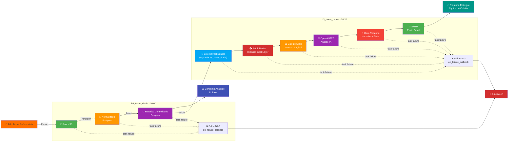

# Arquitetura da Solução

Componentes:
- Airflow: orquestração
- S3: armazenamento bruto
- Postgres/Athena: camada Gold
- LLM (OpenAI): análise e geração de relatórios
- SMTP: envio de emails
- Slack: alertas

## 📊 Diagrama do Pipeline



## 🏗️ Arquitetura em Camadas

### **Bronze Layer 🥉**
- **Armazenamento**: AWS S3
- **Conteúdo**: Dados brutos da B3 (CSV original)
- **Frequência**: Diária (20:00)
- **Retenção**: Histórico completo

### **Silver Layer 🥈**
- **Armazenamento**: PostgreSQL (Schema `silver`)
- **Conteúdo**: Dados normalizados e estruturados
- **Transformações**: Renomear colunas, tipos de dados, validações
- **Frequência**: Diária (após Bronze)
- **Schema**: `curva_referencial_diaria`

### **Gold Layer 🥇**
- **Armazenamento**: PostgreSQL (Schema `gold`)
- **Conteúdo**: Histórico consolidado para consumo analítico
- **Otimização**: Índices, partições por data
- **Frequência**: Diária (após Silver)
- **Schema**: `curva_referencial_historica`
- **Chave Primária**: `(data_referencia, tipo_curva, vencimento)`


## 🔄 DAGs do Airflow

### **1️⃣ b3_taxas_diario** (Principal)
**Agendamento**: `0 20 * * 1-5` (20:00 seg-sex)

| Task | Descrição | Responsável |
|------|-----------|------------|
| `run_pipeline` | Executa ETL completo | Python Operator |
| Extract | Download de CSV da B3 | `scripts/extract.py` |
| Transform | Normalização de dados | `scripts/transform.py` |
| Load | Upsert em Postgres | `scripts/load.py` |

**Saída**: Dados em Gold Layer prontos para análise


### **2️⃣ b3_taxas_report** (Novo - com LLM) ✨
**Agendamento**: `0 20:20 * * 1-5` (20:20 seg-sex)

| Task | Descrição | Responsável |
|------|-----------|------------|
| `wait_for_b3_taxas_diario` | Aguarda conclusão | ExternalTaskSensor |
| `generate_and_send_report` | Gera e envia relatório | Python Operator |

**Processo**:
1. **Fetch** → Busca dados do Gold Layer
2. **Análise** → Calcula estatísticas e envia para OpenAI GPT
3. **Geração** → LLM cria narrativa executiva automática
4. **Envio** → Relatório enviado via SMTP para equipe de crédito

**Saída**: Emails com relatórios analíticos inteligentes

## 🧩 Componentes Principais

| Componente | Função | Stack |
|-----------|--------|-------|
| **Apache Airflow** | Orquestração de DAGs | Python |
| **PostgreSQL** | Camadas Silver/Gold | RDS/Container |
| **AWS S3** | Armazenamento Bronze | Cloud Storage |
| **OpenAI GPT** | Análise com LLM | REST API |
| **SMTP** | Envio de elementos | Gmail/Corporativo |
| **Slack** | Alertas de erro | WebHook |

## Modelagem de Dados

- **curva_referencial_raw (Bronze)** → arquivo original
- **curva_referencial_diaria (Silver)** → granularidade diária por curva/vencimento
- **curva_referencial_historica (Gold)** → consolidado para consumo analítico

## Garantia de Qualidade dos Dados

- Completude: comparação com calendário oficial B3
- Continuidade: retry automático e backfill manual
- Consistência: validação de curvas (DI x Pré, Ajuste Pré, DI x TR)
- Validações adicionais: taxa > 0, duplicidade, schema

## 📊 Fluxo de Dados

```
B3 (Fonte)
  ↓
20:00 ← Extração (CSV download)
  ↓
Bronze (Raw S3)
  ↓
Transform (Normalização)
  ↓
Silver (Postgres - estruturado)
  ↓
Load (UPSERT)
  ↓
Gold (Postgres - histórico)
  ↓
├─→ 📊 BI Tools (Consumo analítico)
├─→ 20:20 b3_taxas_report
    ├─→ 🤖 OpenAI GPT (Análise)
    ├─→ 📝 Gerar Relatório
    └─→ 📧 Enviar Email
```

## 🔒 Segurança & Configuração

### **Variáveis de Ambiente**
- `OPENAI_API_KEY` - Chave API OpenAI
- `SENDER_EMAIL` / `SENDER_PASSWORD` - Credenciais SMTP
- `EMAIL_RECIPIENTS` - Destinatários do relatório
- `DB_CONNECTION_STRING` - Conexão Postgres
- `AIRFLOW__CORE__FERNET_KEY` - Chave de criptografia Airflow
