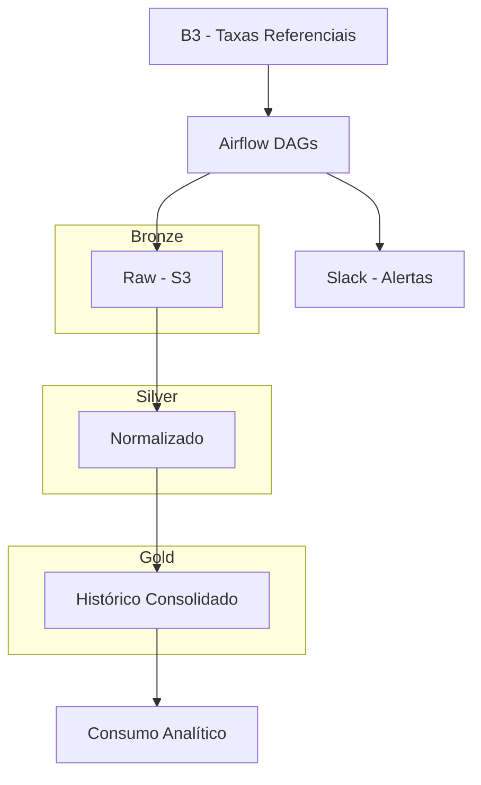

# Arquitetura da Solução

Fluxo:
B3 → Airflow → Bronze (S3) → Silver → Gold → Consumo analítico

Componentes:
- Airflow: orquestração
- S3: armazenamento bruto
- Postgres/Athena: camada Gold
- Slack: alertas

## 📊 Diagrama do Pipeline

